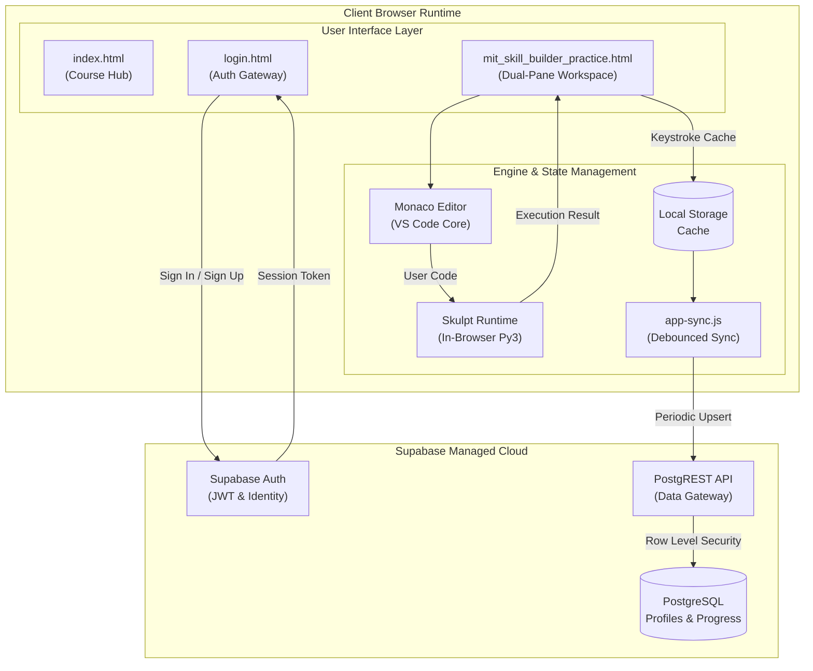

<p align="center">
  
</p>

<h1 align="center">MIT Skill Builder</h1>

<p align="center">
  <strong>An enterprise-grade, browser-based Python learning and exam preparation platform.</strong><br>
  Zero-setup code execution &bull; Automated test grading &bull; Adaptive MCQ drills &bull; Cloud progress sync
</p>

<p align="center">
  <a href="https://gugan207.github.io/Skill-builder/"></a>
  <a href="#-curriculum-overview"></a>
  <a href="https://supabase.com"></a>
  <a href="https://microsoft.github.io/monaco-editor/"></a>
  <a href="LICENSE"></a>
</p>

<p align="center">
  <a href="#-key-features">Features</a> &bull;
  <a href="#-curriculum-overview">Curriculum</a> &bull;
  <a href="#-system-architecture">Architecture</a> &bull;
  <a href="#-getting-started">Getting Started</a> &bull;
  <a href="#-database-setup-supabase">Database Setup</a> &bull;
  <a href="#-admin-analytics--export">Admin Export</a> &bull;
  <a href="#-troubleshooting">Troubleshooting</a>
</p>

---

## 🎯 Overview

**MIT Skill Builder** is a self-contained learning environment designed to help students master Python and prepare for coding assessments. Built around the same core editor that powers **Visual Studio Code (Monaco)** and an in-browser Python interpreter (**Skulpt**), students can write, execute, and validate Python code in real time without installing compilers, configuring Python paths, or managing virtual environments.

Every submission is auto-evaluated against comprehensive test suites with granular diff inspections, character-level comparison diagnostics, and conceptual hints.

---

## ⚡ Key Features

| Capability | Technical Detail |
|---|---|
| **Full In-Browser IDE** | Built on **Monaco Editor** with Python syntax highlighting, bracket matching, autocomplete, keyboard shortcuts (`Ctrl+Enter` to run, `Ctrl+/` to comment), and dark/light modes. |
| **Zero-Server Execution** | Client-side Python execution via **Skulpt (Python 3.x to JS compiler)**. Code executes sandbox-isolated directly inside the user's browser thread with runtime execution limits (5s timeout). |
| **Diagnostic Test Grader** | Evaluates code against multiple test assertions with detailed error breakdowns (runtime tracebacks, line count mismatches, whitespace differences, and case-sensitivity warnings). |
| **Interactive MCQ Engine** | Features per-session **Fisher-Yates option & question randomization**, auto-advance feedback loops, and an animated radial score indicator. |
| **Resilient Cloud Persistence** | Dual-tier storage: Instant auto-saving to browser `localStorage` on every keystroke, plus background 30-second throttled synchronization with **Supabase PostgreSQL** via Row Level Security (RLS). |
| **Responsive Workspace** | Draggable dual-panel layout with horizontal splitter on desktop, collapsible sidebars, and dedicated mobile/tablet viewing transitions. |
| **Enterprise Export Suite** | Python administrative export utility that aggregates all student performance across cohorts into Excel-compatible structured CSVs. |

---

## 📚 Curriculum Overview

The course spans **9 structured weeks**, containing **44 programming challenges** and **90 conceptual multiple-choice questions** (134 total):

```
Week 1 ──► Week 2 ──► Week 3 ──► Week 4 ──► Week 5 ──► Week 6 ──► Week 7 ──► Week 8 ──► Week 9
Basics      Control    Strings    Functions   Data       File I/O   OOP        Exceptions Pandas
& I/O       Flow       & Lists    & Scope     Structures Basics     Principles & Errors   Data Analysis
```

| Week | Core Module | Coding Tasks | MCQs | Focus Areas |
|:---:|---|:---:|:---:|---|
| **01** | Python Fundamentals & I/O | 5 | 20 | Variable assignment, arithmetic operators, string formatting, dynamic `input()` |
| **02** | Control Flow & Loops | 5 | 20 | Nested `if-elif-else`, `while` iterations, `for` loops, loop terminators (`break`/`continue`) |
| **03** | Strings & Sequence Types | 5 | 20 | Slicing syntax, string manipulation methods, list comprehensions, index operations |
| **04** | Modular Functions & Scope | 5 | 20 | Parameters, keyword arguments, return values, recursive routines, namespace scope |
| **05** | Complex Data Structures | 4 | 10 | Tuples, dictionaries, hash sets, key-value mappings, nested collections |
| **06** | File System & Stream I/O | 5 | — | Context managers (`with`), read/write streams, buffer parsing, file cursors |
| **07** | Object-Oriented Programming | 5 | — | Classes, `__init__` constructors, encapsulation, inheritance patterns, polymorphism |
| **08** | Defensive Coding & Exceptions | 5 | — | Structured exception handling (`try-except-finally`), custom exceptions, assertions |
| **09** | Practical Data Analysis | 5 | — | Tabular operations, series indexing, aggregation *(Designed for offline / Colab)* |
| **Total** | **Comprehensive Curriculum** | **44** | **90** | **134 Assessment Units** |

> **Note on Week 9:** Questions in Week 9 involve scientific packages (`pandas`, `numpy`). Because browser-based client runtimes do not bundle native C-extensions, these modules are designated for local Python 3.10+ or Google Colab environments.

---

## 🏛 System Architecture



### Data Flow

1. **Authentication:** `auth.js` connects to Supabase Auth over HTTPS. Upon sign-in, an authenticated JWT session is issued and cached locally.
2. **Execution:** Code is edited in Monaco and executed client-side via Skulpt. Test cases defined in `questions.js` are fed sequentially into standard input streams.
3. **Synchronization:** Every test pass updates the local `Set`. `app-sync.js` monitors state transitions and dispatches debounced upsert requests to Supabase `user_progress` every 30 seconds.

---

## 🚀 Getting Started

### Prerequisites

- **Web Browser:** Any modern browser supporting ECMAScript 2020+ (Chrome, Firefox, Safari, Edge).
- **Local Server (Optional):** [Node.js](https://nodejs.org/) 16+ or [Python](https://www.python.org/) 3.8+ to serve static assets locally.

### Local Development Setup

```bash
# 1. Clone the repository
git clone https://github.com/gugan207/Skill-builder.git
cd Skill-builder

# 2. Launch using Node.js dev server (zero dependencies)
node server.js 8000

# OR launch using Python
python -m http.server 8000
```

Open your browser and navigate to:
```
http://localhost:8000
```

### Application Endpoints

| Path | Description | Access |
|---|---|:---:|
| `/` or `/index.html` | Course syllabus & navigation dashboard | Authenticated |
| `/login.html` | User sign-in, account creation, and password reset | Public |
| `/mit_skill_builder_practice.html` | Main interactive coding IDE and test harness | Authenticated |

---

## 💾 Database Setup (Supabase)

To connect your own Supabase instance:

### 1. Initialize Database Schema

Open the **[Supabase SQL Editor](https://supabase.com/dashboard)** for your project and execute [`supabase_setup.sql`](supabase_setup.sql):

```sql
-- 1. Profiles Table
CREATE TABLE IF NOT EXISTS public.profiles (
  id UUID REFERENCES auth.users(id) ON DELETE CASCADE PRIMARY KEY,
  full_name TEXT,
  email TEXT,
  created_at TIMESTAMPTZ DEFAULT now()
);

-- 2. User Progress Table
CREATE TABLE IF NOT EXISTS public.user_progress (
  user_id UUID REFERENCES auth.users(id) ON DELETE CASCADE PRIMARY KEY,
  solved_questions JSONB DEFAULT '[]'::jsonb,
  code_saves JSONB DEFAULT '{}'::jsonb,
  updated_at TIMESTAMPTZ DEFAULT now()
);

-- 3. Enable Row-Level Security
ALTER TABLE public.profiles ENABLE ROW LEVEL SECURITY;
ALTER TABLE public.user_progress ENABLE ROW LEVEL SECURITY;

-- 4. Idempotent Security Policies
DROP POLICY IF EXISTS "Users can view own profile" ON public.profiles;
CREATE POLICY "Users can view own profile" ON public.profiles FOR SELECT USING (auth.uid() = id);

DROP POLICY IF EXISTS "Users can insert own profile" ON public.profiles;
CREATE POLICY "Users can insert own profile" ON public.profiles FOR INSERT WITH CHECK (auth.uid() = id);

DROP POLICY IF EXISTS "Users can update own profile" ON public.profiles;
CREATE POLICY "Users can update own profile" ON public.profiles FOR UPDATE USING (auth.uid() = id);

DROP POLICY IF EXISTS "Users can view own progress" ON public.user_progress;
CREATE POLICY "Users can view own progress" ON public.user_progress FOR SELECT USING (auth.uid() = user_id);

DROP POLICY IF EXISTS "Users can insert own progress" ON public.user_progress;
CREATE POLICY "Users can insert own progress" ON public.user_progress FOR INSERT WITH CHECK (auth.uid() = user_id);

DROP POLICY IF EXISTS "Users can update own progress" ON public.user_progress;
CREATE POLICY "Users can update own progress" ON public.user_progress FOR UPDATE USING (auth.uid() = user_id);
```

### 2. Configure Credentials

Update the configuration blocks in the respective frontend files:

- [`auth.js`](auth.js):
  ```javascript
  const SUPABASE_URL = 'https://YOUR_PROJECT_ID.supabase.co';
  const SUPABASE_ANON_KEY = 'your-public-anon-key';
  ```
- [`app-sync.js`](app-sync.js):
  ```javascript
  const SYNC_SUPABASE_URL = 'https://YOUR_PROJECT_ID.supabase.co';
  const SYNC_SUPABASE_ANON_KEY = 'your-public-anon-key';
  ```

### 3. Disable Email Confirmation (Recommended for Testing)

To allow students to sign up and immediately start coding without email validation:
1. Navigate to **Authentication &rarr; Providers &rarr; Email** in the Supabase Dashboard.
2. Toggle off **Confirm email**.
3. Save changes.

---

## 📊 Admin Analytics & Export

Skill Builder includes a backend extraction utility ([`export_data.py`](export_data.py)) designed for instructors to aggregate cohort metrics without modifying frontend code.

```bash
# Run the extractor
python export_data.py
```

### What It Generates

The script exports a timestamped CSV spreadsheet (`SkillBuilder_Export_v2_YYYY-MM-DD.csv`) containing:
- **Student Identifiers:** User ID, display name, email address, registration timestamp.
- **Weekly Progress:** Completed coding challenges and MCQ accuracy breakdown per week (Weeks 1–9).
- **Completion Percentages:** Aggregated platform completion score (`X / 134`).

---

## 🛠 Repository Layout

```
Skill-builder/
├── index.html                      # Course selection dashboard
├── login.html                      # Authentication gateway
├── mit_skill_builder_practice.html  # Core dual-pane practice IDE
│
├── app.js                          # Editor controllers, Skulpt runner, and test grader
├── auth.js                         # Supabase GoTrue authentication logic
├── app-sync.js                     # Background debounced progress sync
├── questions.js                    # Question bank (134 problem definitions & tests)
├── tests.js                        # Client-side automated regression suite (88 tests)
│
├── style.css                       # Practice page styles (Dracula dark & light mode)
├── login.css                       # Split-screen authentication theme
├── index.css                       # Dashboard layout & glassmorphic aesthetics
├── favicon.svg                     # Vector brandmark
│
├── server.js                       # Lightweight local development HTTP server
├── export_data.py                  # Instructor reporting & analytics tool
├── count.py                        # Dataset verification script
├── supabase_setup.sql              # Production DDL and RLS access policies
│
└── .github/
    └── workflows/
        └── keepalive.yml           # Scheduled GitHub Action to keep Supabase warm
```

---

## 🔧 Troubleshooting

| Symptom | Probable Cause | Resolution |
|---|---|---|
| **"Cannot reach the server" on login** | Supabase project is paused or hibernated. | Visit [Supabase Dashboard](https://supabase.com/dashboard) and restore the project. |
| **"Could not find table public.profiles"** | Initial SQL migration has not been applied. | Run [`supabase_setup.sql`](supabase_setup.sql) inside the Supabase SQL Editor. |
| **Monaco Editor fails to render** | CDN asset blocked by network/firewall. | Ensure access to `cdnjs.cloudflare.com` is permitted on your network. |
| **Code execution hangs indefinitely** | Student code triggered an infinite loop. | Execution automatically halts after 5 seconds via Skulpt timeout guards. |
| **ModuleNotFoundError on Week 9** | `pandas` / `numpy` requested in browser. | Week 9 modules require C-extensions; run locally with `python3` or in Google Colab. |

---

## 📜 License

This project is licensed under the **MIT License**. See the [LICENSE](LICENSE) file for complete terms.

<p align="center">
  <sub>Engineered with precision for Python educators and students worldwide.</sub>
</p>
